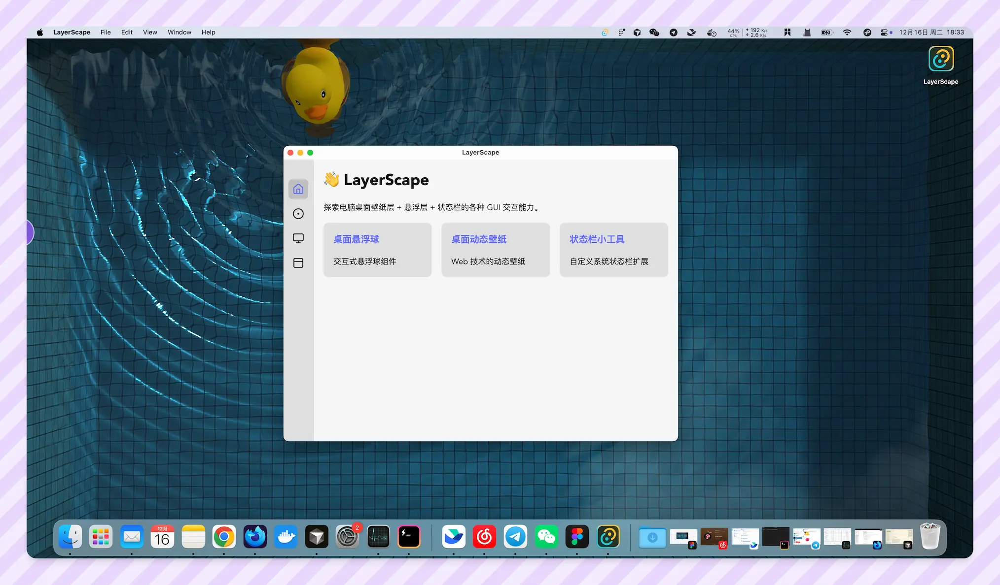

# LayerScape

探索电脑桌面壁纸层 + 悬浮层 + 状态栏的各种 GUI 交互能力。

演示视频 👉 https://youtu.be/LJundyn2epQ

## 核心能力

- [x] 状态栏小工具（支持动态图标 + 自定菜单页面）
- [x] 桌面悬浮球（支持跨屏幕拖拽 + 贴边收起/展开）
- [x] 桌面动态壁纸（支持任意网页元素 + 鼠标交互）

## 下游任务

基于上面提供的各种能力，你可以快速实现任意形态 + 位置的 GUI 应用，比如：

- 复制/粘贴（润色 + 问答 + 文件中转站 + 快捷操作）
- 截屏（支持绘制文字/箭头 + 抠图 + OCR + 贴图等）
- 悬浮球/任务栏快捷操作、小工具等
- ……

## License

MIT License © 2025-PRESENT [Del Wang](https://github.com/idootop)
